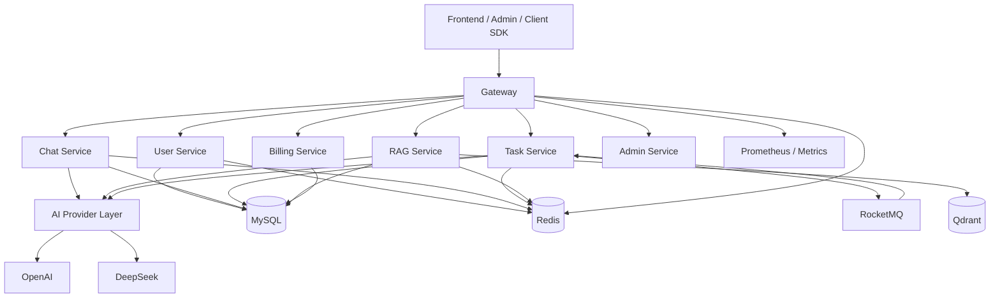

# AI SaaS Backend Platform

<p align="center">
  面向 AI 应用场景的企业级 SaaS 后端平台，基于 Spring Cloud Alibaba 构建，聚焦多模型对话、异步任务、RAG 知识库、计费配额与网关治理。
</p>

<p align="center">
  
  
  
  
  
  
  
  
</p>

## 项目简介

`AI SaaS Backend Platform` 是一个以 AI 产品后端为目标形态构建的微服务项目，覆盖了从统一接入、认证鉴权、AI 对话、异步任务、RAG 知识库、Token 计费，到观测治理的一整套后端能力。

本项目的工程特征：

- 面向生产的微服务拆分与统一网关治理
- 面向 AI 业务的多模型抽象、流式响应与成本追踪
- 面向复杂耗时场景的异步任务编排、重试与进度推送
- 面向知识增强场景的文档解析、切片、Embedding 与向量检索
- 面向 SaaS 商业化的用户体系、配额管理与 Token 统计

## 核心能力

### 1. 微服务与网关治理

- 基于 `Spring Cloud Gateway` 提供统一接入层
- 支持动态路由、JWT 鉴权、IP 黑白名单、访问日志与性能日志
- 集成 `Retry`、`CircuitBreaker`、`RequestRateLimiter` 等治理能力
- 通过 `Nacos` 实现注册发现与配置中心，通过 `Sentinel` 承担限流降级

### 2. AI 对话服务

- 支持同步对话与 `SSE` 流式对话
- 支持多轮上下文管理、会话历史存储与生成状态查询
- 提供 Prompt 模板管理能力，适配业务化对话场景
- 通过公共 AI 抽象层统一模型接入方式

### 3. 异步任务引擎

- 支持摘要、提取、报告生成等耗时 AI 任务
- 基于 `RocketMQ` 实现任务投递、消费与削峰填谷
- 内置任务状态机、处理器工厂、责任链执行模型
- 支持任务重试、失败回溯、SSE 进度流推送与结果查询

### 4. RAG 知识库

- 支持文档上传、解析、切片、Embedding 与索引构建
- 支持基于 `Qdrant` 的向量集合管理与检索
- 提供检索增强问答能力，可配置 `topK`、相似度阈值与模型参数
- 具备知识库构建状态、文档处理状态等缓存键设计

### 5. 商业化与成本控制

- 支持用户注册登录、JWT 令牌刷新、验证码、密码重置
- 支持 Token 使用记录、按模型统计、按操作类型统计、费用测算
- 支持用户配额、VIP 体系、角色权限与消费追踪
- 统一封装响应结构、错误码与时间戳，便于前后端协同

## 架构总览



## 工程亮点

| 维度 | 实现方式 | 价值 |
|------|------|------|
| 模型接入 | `AIProvider` + `AIProviderFactory` | 统一 OpenAI / DeepSeek 等模型调用入口，降低业务层耦合 |
| 流式交互 | `SseEmitter` + 对话状态查询 | 支撑 AI 实时输出，改善前端交互体验 |
| 异步执行 | `RocketMQ` + 任务执行引擎 + 状态机 | 处理长耗时、高成本、可重试的 AI 任务 |
| 任务编排 | Processor Factory + Handler Chain | 提升任务类型扩展性与执行流程可维护性 |
| 检索增强 | 文档解析 + 文本切片 + Embedding + Qdrant | 支撑企业知识库问答与语义检索场景 |
| 平台治理 | Gateway + Nacos + Sentinel | 提供鉴权、限流、重试、熔断、配置集中化能力 |
| 服务间调用 | 同步 `OpenFeign` + 异步 `RocketMQ` | 强一致读（配额校验）走同步，可异步的写（计费扣减）走 MQ + 幂等，职责分离 |
| 成本可视化 | Token Usage 记录与统计 | 适配 AI 产品实际计费、配额和运营分析需求 |
| 通用基础设施 | `Result`、`RedisKeys`、MQ/缓存工具 | 保持跨服务接口风格与基础能力一致性 |

## 技术栈

| 分类 | 技术方案 |
|------|------|
| 语言与运行时 | Java 17 |
| 基础框架 | Spring Boot 3.2.5 |
| 微服务体系 | Spring Cloud 2023.0.1、Spring Cloud Alibaba 2023.0.0.0-RC1 |
| 网关与治理 | Spring Cloud Gateway、Sentinel、Nacos |
| 数据访问 | MyBatis-Plus 3.5.6、MySQL 8 |
| 缓存 | Redis 7、Redisson |
| 消息队列 | RocketMQ Spring Boot Starter 2.3.0 |
| 服务调用 | Spring Cloud OpenFeign 4.1.1（Nacos 服务发现 + LoadBalancer） |
| AI 能力 | LangChain4j 0.31.0、OpenAI、DeepSeek |
| 向量检索 | Qdrant |
| 监控运维 | Spring Actuator、Micrometer、Prometheus |
| 常用组件 | Hutool、Guava、MapStruct |

## 模块说明

| 模块 | 说明 |
|------|------|
| `ai-saas-common` | 公共基础模块，封装 AI 抽象、向量存储、统一响应、Redis Key、配置与工具类 |
| `ai-saas-gateway` | 统一接入网关，负责路由、鉴权、限流、熔断、日志与安全过滤 |
| `ai-saas-user-service` | 用户中心，提供认证、角色权限、配额、设置、VIP 管理 |
| `ai-saas-chat-service` | AI 对话服务，提供同步/流式对话、会话管理、消息管理、Prompt 模板 |
| `ai-saas-task-service` | 异步任务服务，提供任务创建、进度查询、取消、重试、消费执行 |
| `ai-saas-rag-service` | RAG 服务，提供知识库、文档处理、向量化检索与问答 |
| `ai-saas-billing-service` | 计费服务，负责 Token 消耗记录、统计分析、费用测算与配额支撑 |
| `ai-saas-admin-service` | 管理端服务入口模块，预留平台管理与运营扩展能力 |

## 目录结构

```text
ai-saas-backend-platform/
├── ai-saas-common/
├── ai-saas-gateway/
├── ai-saas-user-service/
├── ai-saas-chat-service/
├── ai-saas-task-service/
├── ai-saas-rag-service/
├── ai-saas-billing-service/
├── ai-saas-admin-service/
├── docs/
│   └── v1/
├── sql/
└── README.md
```

## 关键接口能力

以下接口来自当前代码与设计文档，可作为前后端联调入口：

| 场景 | 示例接口 | 说明 |
|------|------|------|
| 用户认证 | `POST /api/auth/register` | 注册并获取令牌 |
| 用户认证 | `POST /api/auth/login` | 登录并签发访问令牌 |
| AI 流式对话 | `POST /api/v1/ai-chat/stream` | 基于 `SSE` 返回模型生成内容 |
| AI 同步对话 | `POST /api/v1/ai-chat/chat` | 返回完整对话结果 |
| 生成控制 | `POST /api/v1/ai-chat/stop` | 中止正在进行的生成请求 |
| 任务系统 | `POST /api/v1/tasks` | 创建异步任务 |
| 任务进度 | `GET /api/v1/tasks/{taskId}/progress/stream` | 订阅任务进度流 |
| RAG 问答 | `POST /api/v1/rag/query` | 执行检索增强问答 |
| 文档入库 | `POST /api/v1/rag/documents/upload` | 上传文档并完成索引 |
| Token 计费 | `GET /billing/token/statistics` | 查询 Token 使用统计 |

## 统一响应格式

项目通过公共模块统一封装接口返回体，典型结构如下：

```json
{
  "code": 200,
  "message": "操作成功",
  "data": {},
  "traceId": "trace-20240101-abc123",
  "timestamp": 1704067200000
}
```

这使得网关、业务服务、监控排查和前端联调具备统一协议基础。

## 开发环境要求

- JDK 17+
- Maven 3.8+
- MySQL 8.0+
- Redis 7+
- Nacos 2.2+
- RocketMQ 5.x
- Qdrant 1.9+（启用 RAG 能力时）

## 快速开始

### 1. 克隆项目

```bash
git clone <your-repo-url>
cd ai-saas-backend-platform
```

### 2. 启动基础依赖

建议先准备以下组件：

- MySQL
- Redis
- Nacos
- RocketMQ
- Qdrant

### 3. 初始化数据库

各模块已在 `resources/db/` 目录下提供初始化脚本，可按模块执行：

```text
ai-saas-user-service/src/main/resources/db/user_init.sql
ai-saas-chat-service/src/main/resources/db/chat_init.sql
ai-saas-task-service/src/main/resources/db/task_init.sql
ai-saas-rag-service/src/main/resources/db/rag_init.sql
ai-saas-billing-service/src/main/resources/db/billing_init.sql
```

### 4. 配置环境变量

可按模块配置以下常用变量：

```bash
MYSQL_HOST=localhost
MYSQL_PORT=3306
MYSQL_USERNAME=root
MYSQL_PASSWORD=root
REDIS_HOST=localhost
REDIS_PORT=6379
NACOS_SERVER_ADDR=localhost:8848
ROCKETMQ_NAME_SERVER=localhost:9876
OPENAI_API_KEY=your_openai_api_key
DEEPSEEK_API_KEY=your_deepseek_api_key
QDRANT_HOST=localhost
QDRANT_PORT=6334
```

### 5. 编译项目

```bash
mvn clean install -DskipTests
```

### 6. 启动服务

可按照以下顺序逐个启动：

```bash
mvn -pl ai-saas-gateway spring-boot:run
mvn -pl ai-saas-user-service spring-boot:run
mvn -pl ai-saas-chat-service spring-boot:run
mvn -pl ai-saas-task-service spring-boot:run
mvn -pl ai-saas-rag-service spring-boot:run
mvn -pl ai-saas-billing-service spring-boot:run
mvn -pl ai-saas-admin-service spring-boot:run
```

## 服务与配置说明

当前仓库中的本地配置文件已定义了主要服务名与部分默认端口，但实际运行端口可被 `application.yml`、环境变量与 `Nacos` 配置覆盖。接入生产或多人协作环境时，建议统一在配置中心编排，避免本地示例端口冲突。

| 服务 | Spring Application Name | 默认职责 |
|------|------|------|
| Gateway | `ai-saas-gateway` | 统一入口、鉴权、限流、路由 |
| User | `ai-saas-user-service` | 用户、权限、配额、VIP |
| Chat | `ai-saas-chat-service` | AI 对话、Prompt 模板、消息管理 |
| Task | `ai-saas-task-service` | 异步任务调度与执行 |
| RAG | `ai-saas-rag-service` | 文档处理、检索增强问答 |
| Billing | `billing-service` | Token 计费与统计 |
| Admin | `ai-saas-admin-service` | 平台管理扩展入口 |

## 可观测性与稳定性设计

- 网关暴露 `health`、`info`、`gateway`、`prometheus`、`metrics` 等 Actuator 端点
- 统一日志格式中预留 `traceId`，便于链路问题定位
- 网关支持慢请求日志、访问日志、请求/响应日志
- 任务系统包含执行状态跟踪、失败重试、异常堆栈记录与完成通知
- Redis Key 设计覆盖会话、配额、上下文、任务进度、幂等、黑名单、验证码等常见场景

## 适用场景

- AI Chat / Copilot 类产品后端
- 企业知识库与问答平台
- 需要计费、配额、权限与审计能力的 AI SaaS 平台
- 需要长耗时任务编排与进度可视化的 AI 工作台

## 文档索引

项目附带较完整的设计文档，建议结合阅读：

- [架构设计文档](docs/v1/design_v1.md)
- [详细实现文档](docs/v1/implementation_v1.md)
- [接口设计文档](docs/v1/implementation_api.md)
- [数据库设计文档](docs/v1/implementation_tables.md)
- [开发计划文档](docs/v1/development_plan.md)

## 后续演进方向

- 增强 Admin 服务的运营管理与系统配置能力
- 接入更多模型 Provider 与智能路由策略
- 补充容器化部署、`docker-compose` 与 CI/CD 流程
- 增加链路追踪、审计报表与多租户隔离策略
- 扩展 Agent Workflow、Tool Calling 与 MCP 集成能力

## License

Apache License 2.0

## 功能实现状态（诚实声明，简历勿写）

代码中已无 TODO/占位符实现，核心链路均已落地并可通过测试验证：JWT 登录与刷新、登出/Token 黑名单、模型降级（ModelFailoverService）、跨服务计费（含幂等与对账）、配额 CAS 扣减与超限/重置记录、账单与用量 CSV 导出、消息重新生成、RAG 检索与切片、文档下载/版本历史/回滚、工作流定义仓储（classpath JSON，可插拔数据库实现）、RocketMQ 事务消息本地业务事件、traceId 全链路。

仍依赖外部基础设施、代码已做诚实降级的部分：

- RAG 文档原始文件的对象存储（MinIO/OSS 未接入）：上传目前仅持久化元数据与解析文本，`downloadDocument` 有解析文本则返回、否则明确报错，不会假装成功
- 短信/邮件发送通道：验证码的生成与校验基于 Redis 已实现，实际下发需接入第三方服务商
